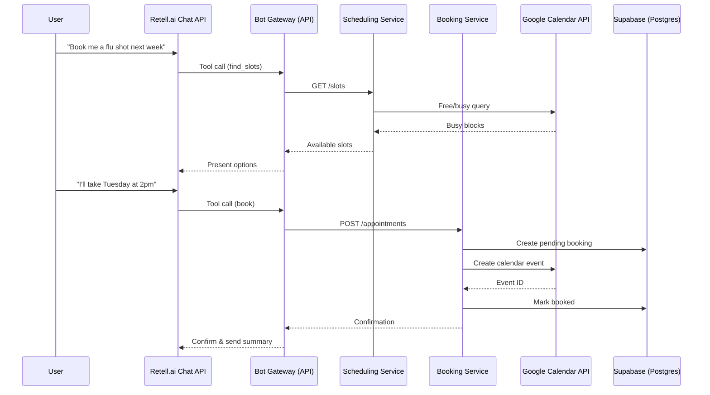

# Appointment Scheduling Bot

Conversational agent that books and reschedules pharmacy appointments on top of the [Retell.ai](https://retell.ai) chat API, integrated with Google Calendar and Supabase.  
Designed to be **voice-ready** with minimal changes, handle edge cases gracefully, and provide a reliable, developer-friendly backend.

---

## 1. Overview

This project was built as part of the **AI Tools Engineer Take-Home Challenge** for MedMe Health.  
It implements a **chat-based booking assistant** for pharmacy services (e.g., flu shots, consultations) that:

- Collects **appointment type**, **preferred date/time**, **patient name**, and **contact information**.
- Checks real availability using the **Google Calendar API**.
- Creates and logs confirmed bookings in **Supabase** (Postgres).
- Handles edge cases such as unavailable slots, missing information, external API failures, and unauthorized changes.
- Is **voice-ready**—the Retell.ai chat integration can be swapped to a voice channel without re-architecting the solution.

---

## 2. Quick Setup

### Prerequisites
- Go 1.22+
- Google Cloud account
- Access to Google Calendar
- Redis (optional, for caching)

### Getting Started
1. **Clone and setup**:
   ```bash
   git clone <repository>
   cd appointment-scheduling-bot
   go mod download
   ```

2. **Configure Google Calendar**:
   - Follow the [Quick Setup Guide](docs/quick-setup.md) (5 minutes)
   - Or see [Full Setup Documentation](docs/google-calendar-setup.md)

3. **Test the setup**:
   ```bash
   ./scripts/test-calendar.sh
   go run scripts/test-calendar-connection.go
   ```

4. **Start development**:
   ```bash
   go run cmd/api/main.go
   curl http://localhost:8080/healthz
   ```

### Configuration
Copy `env.example` to `config.env` and update:
```env
GCAL_CALENDAR_ID=your-calendar@gmail.com
GOOGLE_CREDS_JSON=service-account.json
```

**⚠️ Important**: Never commit `service-account.json` to version control!

---

## 3. Architecture



---

## 4. Modules

| Module                  | Purpose | Technology |
|-------------------------|---------|------------|
| **Bot Gateway**         | Webhook endpoint for Retell.ai; routes tool calls to backend services. | Go (Fiber) |
| **Dialogue/Orchestrator** | Slot filling for required fields; branching for booking/reschedule/cancel. | Prompt + JSON schema tools |
| **Scheduling Service**  | Computes available time slots by merging business rules with Google Calendar busy times; caches results in Redis. | Go, Redis, Google Calendar API |
| **Booking Service**     | Creates, reschedules, and cancels appointments; transactional saga with calendar creation and datastore update. | Go, Supabase/Postgres |
| **Calendar Integration**| Google Calendar adapter for free/busy queries and event creation/update/deletion. | Google API Go SDK |
| **Datastore**           | Logs each confirmed booking with patient and appointment details. | Supabase/Postgres |
| **Notifications** (optional) | Sends confirmation/reminders via email/SMS, attaches `.ics` files. | Go, email/SMS API |
| **Webhooks**            | Handles Retell.ai and Google Calendar push notifications. | Go (Fiber) |
| **Security & Verification** | Confirms user identity before exposing/changing bookings. | Token/email/phone match |
| **Admin CLI**           | Seeds services, working hours, buffers, and demo busy slots. | Go Cobra CLI |

---

## 5. Repository Structure

```plaintext
/cmd/api                # Main HTTP server
/internal/dialog         # Prompt, tool schemas, slot filling
/internal/scheduling     # Slot computation + cache
/internal/booking        # Booking/reschedule/cancel saga
/internal/calendar       # Google Calendar API client
/internal/store          # Supabase adapter
/internal/notify         # Optional email/SMS/ICS
/internal/webhooks       # Retell + calendar webhook handlers
/internal/shared         # Shared types, errors, time utils
/db/migrations           # Database schema migrations
/deploy/docker-compose.yml
README.md
```

---

## 6. Tools & Libraries

- **Go** (1.22) – performance and concurrency-friendly.
- **Fiber** – lightweight web framework.
- **Redis** – fast caching and idempotency.
- **Supabase** – Postgres with built-in auth and REST interface.
- **Google Calendar API** – real availability & event creation.
- **Retell.ai Chat API** – conversation interface (text now, voice later).
- **Cobra CLI** – admin tooling.

---

## 7. Error Handling

- **Unavailable slot:** recomputes and suggests next 3 best options.
- **Missing info:** asks targeted follow-up questions.
- **External API failure:** apologizes, offers human follow-up capture.
- **Unauthorized access:** requires matching contact info or code.
- **Double-booking race:** transactional revalidation + idempotency keys.

---

## 8. If I Had More Time

- Add group appointments and capacity management.
- Build a provider dashboard for manual overrides.
- Implement waitlist + auto-release of no-show holds.
- Multi-service slot merging for complex bookings.

---

## 9. Testing Tips

- Pre-fill Google Calendar with both busy and free slots.
- Simulate a calendar outage to test API failure flow.
- Attempt to book the same slot twice to trigger race handling.
- Test rescheduling and cancel flows with verification enabled.

---

## 10. License

MIT – free to use and adapt.
