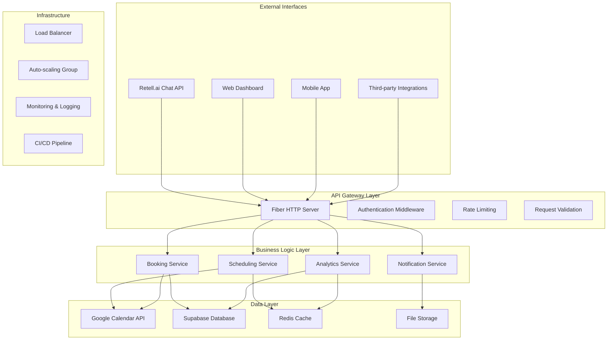
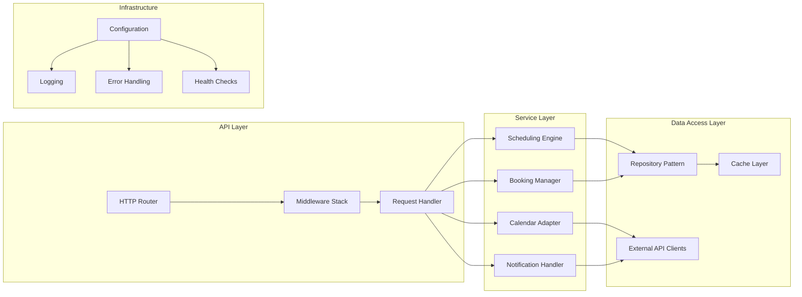
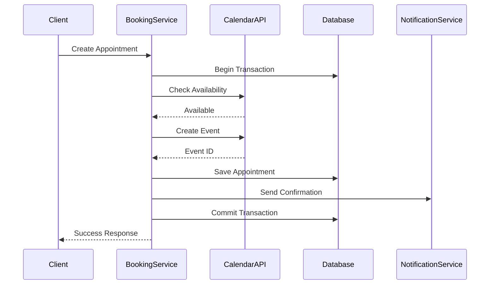
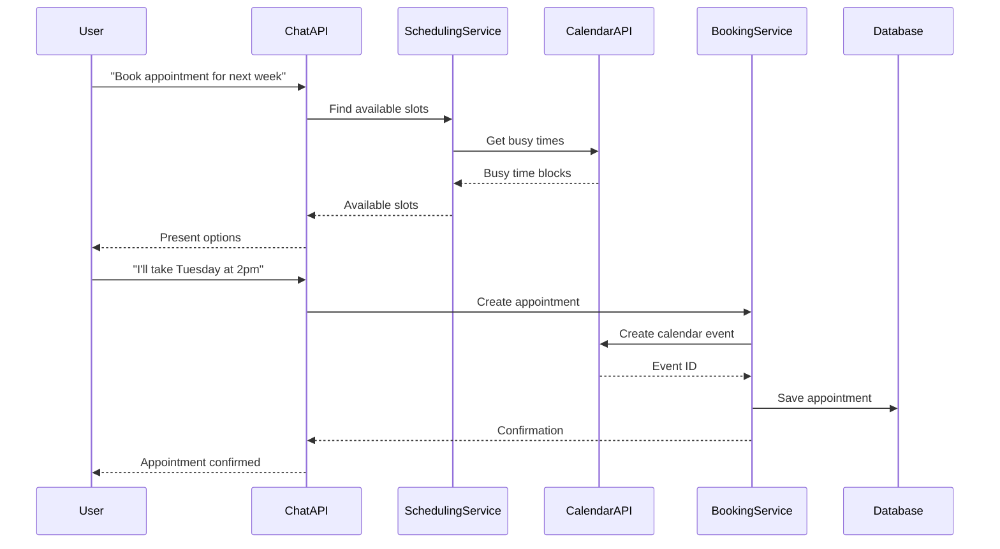
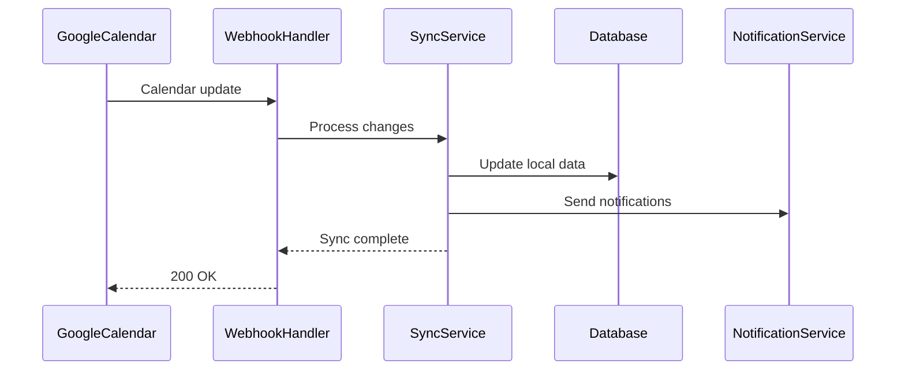

# Architecture Guide

This document provides a comprehensive overview of the Appointment Scheduling Bot's architecture, including system design, components, data flow, and technical decisions.

## Table of Contents

- [Overview](#overview)
- [System Architecture](#system-architecture)
- [Component Design](#component-design)
- [Data Flow](#data-flow)
- [Technology Stack](#technology-stack)
- [Security Architecture](#security-architecture)
- [Scalability Considerations](#scalability-considerations)
- [Monitoring and Observability](#monitoring-and-observability)
- [Deployment Architecture](#deployment-architecture)

## Overview

The Appointment Scheduling Bot is designed as a microservices-based system that provides intelligent appointment scheduling capabilities through multiple interfaces. The system is built with Go for performance and reliability, using modern architectural patterns for scalability and maintainability.

### Key Design Principles

- **Separation of Concerns**: Clear boundaries between different system responsibilities
- **Loose Coupling**: Components communicate through well-defined interfaces
- **High Cohesion**: Related functionality is grouped together
- **Fault Tolerance**: System continues operating even when individual components fail
- **Scalability**: System can handle increased load through horizontal scaling

## System Architecture

### High-Level Architecture



### Component Architecture



## Component Design

### 1. API Gateway (Fiber Server)

The API Gateway serves as the entry point for all external requests, providing:

- **Request Routing**: Directs requests to appropriate handlers
- **Authentication**: Validates user credentials and permissions
- **Rate Limiting**: Prevents API abuse
- **Request Validation**: Ensures data integrity
- **Response Formatting**: Standardizes API responses

**Key Features:**
- RESTful API design
- JSON request/response format
- Standard HTTP status codes
- Comprehensive error handling
- Request/response logging

### 2. Scheduling Service

The Scheduling Service is the core business logic component responsible for:

- **Availability Calculation**: Determines available time slots
- **Conflict Resolution**: Handles scheduling conflicts
- **Business Rules**: Applies scheduling policies and constraints
- **Optimization**: Suggests optimal appointment times

**Core Algorithms:**
```go
type SchedulingService struct {
    calendarClient calendar.Client
    businessRules  BusinessRules
    cache         Cache
}

func (s *SchedulingService) FindAvailableSlots(
    from, to time.Time, 
    duration time.Duration,
    constraints []Constraint,
) ([]TimeSlot, error) {
    // 1. Get busy times from calendar
    busyTimes := s.calendarClient.ListBusy(from, to)
    
    // 2. Apply business rules
    availableSlots := s.businessRules.GenerateSlots(from, to, duration)
    
    // 3. Remove conflicts
    availableSlots = s.removeConflicts(availableSlots, busyTimes)
    
    // 4. Apply constraints
    availableSlots = s.applyConstraints(availableSlots, constraints)
    
    // 5. Cache results
    s.cache.Set(key, availableSlots, ttl)
    
    return availableSlots, nil
}
```

### 3. Booking Service

The Booking Service manages the complete appointment lifecycle:

- **Appointment Creation**: Creates new appointments with validation
- **Modification**: Handles rescheduling and updates
- **Cancellation**: Manages appointment cancellations
- **Conflict Resolution**: Prevents double-booking

**Transaction Flow:**


### 4. Calendar Integration

The Calendar Integration component provides a unified interface to Google Calendar:

- **Abstraction Layer**: Hides Google Calendar API complexity
- **Error Handling**: Manages API failures gracefully
- **Rate Limiting**: Respects API quotas
- **Caching**: Reduces API calls for frequently accessed data

**Interface Design:**
```go
type Client interface {
    // Read operations
    ListBusy(from, to time.Time) ([]TimeBlock, error)
    GetEvent(eventID string) (*Event, error)
    
    // Write operations
    CreateEvent(appt Appointment) (string, error)
    UpdateEvent(eventID string, appt Appointment) error
    DeleteEvent(eventID string) error
    
    // Utility operations
    IsAvailable(slot TimeSlot) (bool, error)
    GetWorkingHours() WorkingHours
}
```

### 5. Data Access Layer

The Data Access Layer provides consistent data access patterns:

- **Repository Pattern**: Abstracts data storage details
- **Caching Strategy**: Improves performance for frequently accessed data
- **Connection Pooling**: Manages database connections efficiently
- **Transaction Management**: Ensures data consistency

**Repository Interface:**
```go
type AppointmentRepository interface {
    Create(ctx context.Context, appt *Appointment) error
    GetByID(ctx context.Context, id string) (*Appointment, error)
    Update(ctx context.Context, appt *Appointment) error
    Delete(ctx context.Context, id string) error
    List(ctx context.Context, filter Filter) ([]*Appointment, error)
}
```

## Data Flow

### 1. Appointment Booking Flow



### 2. Data Synchronization Flow



## Technology Stack

### Backend Technologies

- **Go 1.22+**: High-performance, concurrent programming language
- **Fiber**: Fast HTTP web framework
- **GORM**: Object-relational mapping for database operations
- **Redis**: In-memory data structure store for caching
- **PostgreSQL**: Primary database (via Supabase)

### External Integrations

- **Google Calendar API**: Calendar management and availability
- **Retell.ai**: Chat interface and conversation management
- **Supabase**: Backend-as-a-Service with PostgreSQL

### Development Tools

- **Go Modules**: Dependency management
- **Make**: Build automation
- **Docker**: Containerization
- **Git**: Version control

### Testing & Quality

- **Go Testing**: Unit and integration tests
- **Testify**: Testing utilities and assertions
- **Mockery**: Mock generation for testing

## Security Architecture

### Authentication & Authorization

- **Service Account Authentication**: For Google Calendar API access
- **API Key Management**: Secure storage of external API credentials
- **Input Validation**: Comprehensive request validation
- **Rate Limiting**: Protection against abuse

### Data Security

- **Encryption at Rest**: Sensitive data encryption
- **Encryption in Transit**: TLS for all external communications
- **Access Control**: Principle of least privilege
- **Audit Logging**: Track all data access and modifications

### Security Best Practices

- **Secrets Management**: Environment-based configuration
- **Regular Updates**: Keep dependencies updated
- **Security Scanning**: Automated vulnerability detection
- **Incident Response**: Plan for security incidents

## Scalability Considerations

### Horizontal Scaling

- **Stateless Design**: Services can be replicated horizontally
- **Load Balancing**: Distribute traffic across multiple instances
- **Auto-scaling**: Automatically adjust capacity based on demand
- **Database Sharding**: Partition data for better performance

### Performance Optimization

- **Caching Strategy**: Redis for frequently accessed data
- **Connection Pooling**: Efficient database connection management
- **Async Processing**: Non-blocking operations for better throughput
- **CDN Integration**: Content delivery for static assets

### Monitoring & Alerting

- **Metrics Collection**: Performance and business metrics
- **Health Checks**: Proactive monitoring of service health
- **Alerting**: Notify operators of issues
- **Capacity Planning**: Predict resource needs

## Monitoring and Observability

### Logging Strategy

- **Structured Logging**: JSON format for easy parsing
- **Log Levels**: Appropriate verbosity for different environments
- **Centralized Logging**: Aggregate logs for analysis
- **Log Retention**: Manage log storage and archival

### Metrics and Monitoring

- **Application Metrics**: Business and technical KPIs
- **Infrastructure Metrics**: System resource utilization
- **Custom Dashboards**: Real-time visibility into system health
- **Alerting Rules**: Proactive notification of issues

### Distributed Tracing

- **Request Tracing**: Track requests across service boundaries
- **Performance Analysis**: Identify bottlenecks and optimization opportunities
- **Error Correlation**: Link related errors and failures
- **Dependency Mapping**: Understand service relationships

## Deployment Architecture

### Environment Strategy

- **Development**: Local development environment
- **Staging**: Pre-production testing environment
- **Production**: Live production environment

### Deployment Models

- **Container Deployment**: Docker containers for consistency
- **Orchestration**: Kubernetes for container management
- **Infrastructure as Code**: Terraform for infrastructure management
- **CI/CD Pipeline**: Automated testing and deployment

### High Availability

- **Multi-AZ Deployment**: Geographic redundancy
- **Load Balancing**: Traffic distribution and failover
- **Database Replication**: Data redundancy and read scaling
- **Backup Strategy**: Regular data backups and recovery testing

## Future Architecture Considerations

### Planned Enhancements

- **Microservices Migration**: Break down into smaller, focused services
- **Event-Driven Architecture**: Asynchronous processing with message queues
- **GraphQL API**: More flexible data querying
- **Real-time Updates**: WebSocket support for live updates

### Technology Evolution

- **Go Version Updates**: Leverage latest language features
- **Database Optimization**: Advanced indexing and query optimization
- **Caching Strategy**: Multi-level caching for better performance
- **API Versioning**: Support for multiple API versions

---

**Last Updated**: August 2025  
**Version**: 1.0  
**Maintainer**: Development Team
