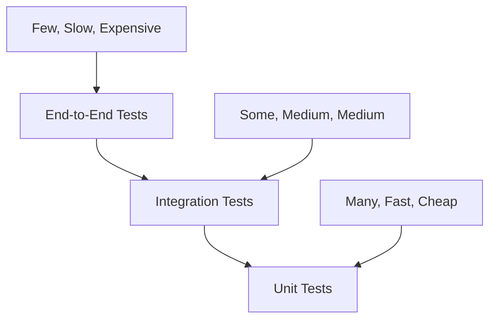

# Testing Guide

This document provides comprehensive guidance on testing the Appointment Scheduling Bot, including testing strategies, examples, and best practices.

## Table of Contents

- [Overview](#overview)
- [Testing Strategy](#testing-strategy)
- [Unit Testing](#unit-testing)
- [Integration Testing](#integration-testing)
- [End-to-End Testing](#end-to-end-testing)
- [Testing Tools](#testing-tools)
- [Test Data Management](#test-data-management)
- [Mocking and Stubbing](#mocking-and-stubbing)
- [Performance Testing](#performance-testing)
- [Testing Best Practices](#testing-best-practices)

## Overview

Testing is a critical component of the Appointment Scheduling Bot development lifecycle. Our testing strategy ensures code quality, reliability, and maintainability through multiple testing layers and comprehensive coverage.

### Testing Philosophy

- **Test-Driven Development (TDD)**: Write tests before implementation when possible
- **Comprehensive Coverage**: Aim for high test coverage across all components
- **Fast Feedback**: Tests should run quickly to enable rapid development
- **Realistic Scenarios**: Test with realistic data and edge cases
- **Continuous Testing**: Integrate testing into the CI/CD pipeline

## Testing Strategy

### Testing Pyramid



### Test Categories

1. **Unit Tests**: Test individual functions and methods in isolation
2. **Integration Tests**: Test component interactions and external dependencies
3. **End-to-End Tests**: Test complete user workflows
4. **Performance Tests**: Test system performance under load
5. **Security Tests**: Test security vulnerabilities and access controls

## Unit Testing

### Go Testing Framework

Go provides a built-in testing framework that we use extensively:

```go
package calendar

import (
    "testing"
    "time"
)

func TestTimeSlot_IsAvailable(t *testing.T) {
    tests := []struct {
        name     string
        slot     TimeSlot
        expected bool
    }{
        {
            name: "available slot",
            slot: TimeSlot{
                Start: time.Date(2025, 8, 9, 9, 0, 0, 0, time.UTC),
                End:   time.Date(2025, 8, 9, 10, 0, 0, 0, time.UTC),
            },
            expected: true,
        },
        {
            name: "unavailable slot",
            slot: TimeSlot{
                Start: time.Date(2025, 8, 9, 9, 0, 0, 0, time.UTC),
                End:   time.Date(2025, 8, 9, 10, 0, 0, 0, time.UTC),
            },
            expected: false,
        },
    }

    for _, tt := range tests {
        t.Run(tt.name, func(t *testing.T) {
            result := tt.slot.IsAvailable()
            if result != tt.expected {
                t.Errorf("TimeSlot.IsAvailable() = %v, want %v", result, tt.expected)
            }
        })
    }
}
```

### Testing Utilities

We use the `testify` package for additional testing utilities:

```go
package calendar

import (
    "testing"
    "github.com/stretchr/testify/assert"
    "github.com/stretchr/testify/require"
)

func TestAppointment_Create(t *testing.T) {
    // Arrange
    appt := &Appointment{
        Summary:       "Test Appointment",
        Description:   "Test Description",
        Start:         time.Now().Add(1 * time.Hour),
        End:           time.Now().Add(2 * time.Hour),
        AttendeeName:  "John Doe",
        AttendeeEmail: "john@example.com",
    }

    // Act
    err := appt.Validate()

    // Assert
    require.NoError(t, err, "Appointment validation should pass")
    assert.NotEmpty(t, appt.ID, "Appointment should have an ID")
    assert.Equal(t, "Test Appointment", appt.Summary)
}
```

### Table-Driven Tests

For testing multiple scenarios, we use table-driven tests:

```go
func TestSchedulingService_FindAvailableSlots(t *testing.T) {
    tests := []struct {
        name        string
        from        time.Time
        to          time.Time
        duration    time.Duration
        busyTimes   []TimeBlock
        expected    []TimeSlot
        expectError bool
    }{
        {
            name:     "no conflicts",
            from:     time.Date(2025, 8, 9, 9, 0, 0, 0, time.UTC),
            to:       time.Date(2025, 8, 9, 17, 0, 0, 0, time.UTC),
            duration: 60 * time.Minute,
            busyTimes: []TimeBlock{},
            expected: []TimeSlot{
                {Start: time.Date(2025, 8, 9, 9, 0, 0, 0, time.UTC), End: time.Date(2025, 8, 9, 10, 0, 0, 0, time.UTC)},
                {Start: time.Date(2025, 8, 9, 10, 0, 0, 0, time.UTC), End: time.Date(2025, 8, 9, 11, 0, 0, 0, time.UTC)},
            },
            expectError: false,
        },
        {
            name:     "with conflicts",
            from:     time.Date(2025, 8, 9, 9, 0, 0, 0, time.UTC),
            to:       time.Date(2025, 8, 9, 17, 0, 0, 0, time.UTC),
            duration: 60 * time.Minute,
            busyTimes: []TimeBlock{
                {Start: time.Date(2025, 8, 9, 10, 0, 0, 0, time.UTC), End: time.Date(2025, 8, 9, 11, 0, 0, 0, time.UTC)},
            },
            expected: []TimeSlot{
                {Start: time.Date(2025, 8, 9, 9, 0, 0, 0, time.UTC), End: time.Date(2025, 8, 9, 10, 0, 0, 0, time.UTC)},
                {Start: time.Date(2025, 8, 9, 11, 0, 0, 0, time.UTC), End: time.Date(2025, 8, 9, 12, 0, 0, 0, time.UTC)},
            },
            expectError: false,
        },
    }

    for _, tt := range tests {
        t.Run(tt.name, func(t *testing.T) {
            // Arrange
            mockCalendar := &MockCalendarClient{
                busyTimes: tt.busyTimes,
            }
            service := NewSchedulingService(mockCalendar)

            // Act
            result, err := service.FindAvailableSlots(tt.from, tt.to, tt.duration)

            // Assert
            if tt.expectError {
                assert.Error(t, err)
            } else {
                assert.NoError(t, err)
                assert.Equal(t, len(tt.expected), len(result))
                for i, expected := range tt.expected {
                    assert.Equal(t, expected.Start, result[i].Start)
                    assert.Equal(t, expected.End, result[i].End)
                }
            }
        })
    }
}
```

## Integration Testing

### Testing External Dependencies

For testing components that interact with external services, we use integration tests:

```go
func TestGoogleCalendarIntegration(t *testing.T) {
    if testing.Short() {
        t.Skip("Skipping integration test in short mode")
    }

    // Arrange
    cfg, err := config.Load()
    require.NoError(t, err)

    client, err := google.NewClient(cfg)
    require.NoError(t, err)

    // Act & Assert
    t.Run("list busy times", func(t *testing.T) {
        from := time.Now()
        to := from.Add(24 * time.Hour)
        
        busyTimes, err := client.ListBusy(from, to)
        require.NoError(t, err)
        assert.NotNil(t, busyTimes)
    })

    t.Run("create and delete test event", func(t *testing.T) {
        testAppt := calendar.Appointment{
            Summary:       "Integration Test Event",
            Description:   "This event will be deleted",
            Start:         time.Now().Add(1 * time.Hour),
            End:           time.Now().Add(2 * time.Hour),
            Timezone:      "UTC",
            Location:      "Test Location",
            AttendeeEmail: "",
        }

        // Create event
        eventID, err := client.CreateEvent(testAppt)
        require.NoError(t, err)
        assert.NotEmpty(t, eventID)

        // Clean up
        err = client.DeleteEvent(eventID)
        require.NoError(t, err)
    })
}
```

### Database Integration Tests

For testing database operations, we use test databases:

```go
func TestAppointmentRepositoryIntegration(t *testing.T) {
    if testing.Short() {
        t.Skip("Skipping database integration test in short mode")
    }

    // Setup test database
    db, cleanup := setupTestDatabase(t)
    defer cleanup()

    repo := NewAppointmentRepository(db)

    t.Run("create and retrieve appointment", func(t *testing.T) {
        // Arrange
        appt := &Appointment{
            Summary:       "Test Appointment",
            Description:   "Test Description",
            Start:         time.Now().Add(1 * time.Hour),
            End:           time.Now().Add(2 * time.Hour),
            AttendeeName:  "John Doe",
            AttendeeEmail: "john@example.com",
        }

        // Act
        err := repo.Create(context.Background(), appt)
        require.NoError(t, err)

        // Assert
        retrieved, err := repo.GetByID(context.Background(), appt.ID)
        require.NoError(t, err)
        assert.Equal(t, appt.Summary, retrieved.Summary)
        assert.Equal(t, appt.AttendeeEmail, retrieved.AttendeeEmail)
    })
}
```

## End-to-End Testing

### API Endpoint Testing

Test complete API workflows:

```go
func TestAppointmentAPIEndToEnd(t *testing.T) {
    if testing.Short() {
        t.Skip("Skipping E2E test in short mode")
    }

    // Setup test server
    app := setupTestServer(t)
    defer app.Shutdown()

    t.Run("complete appointment booking flow", func(t *testing.T) {
        // 1. Check availability
        resp, err := app.Test(httptest.NewRequest(
            "GET",
            "/api/v1/calendar/slots?from=2025-08-09T00:00:00Z&to=2025-08-09T23:59:59Z&duration=60",
            nil,
        ))
        require.NoError(t, err)
        assert.Equal(t, 200, resp.StatusCode)

        var slotsResponse struct {
            Slots []TimeSlot `json:"slots"`
        }
        err = json.NewDecoder(resp.Body).Decode(&slotsResponse)
        require.NoError(t, err)
        assert.NotEmpty(t, slotsResponse.Slots)

        // 2. Create appointment
        appointmentData := map[string]interface{}{
            "summary":        "E2E Test Appointment",
            "description":    "End-to-end test",
            "start":          "2025-08-09T09:00:00Z",
            "end":            "2025-08-09T10:00:00Z",
            "attendee_name":  "Jane Doe",
            "attendee_email": "jane@example.com",
            "location":       "Test Location",
            "timezone":       "UTC",
        }

        jsonData, _ := json.Marshal(appointmentData)
        resp, err = app.Test(httptest.NewRequest(
            "POST",
            "/api/v1/appointments",
            bytes.NewBuffer(jsonData),
        ))
        require.NoError(t, err)
        assert.Equal(t, 201, resp.StatusCode)

        var createdAppt Appointment
        err = json.NewDecoder(resp.Body).Decode(&createdAppt)
        require.NoError(t, err)
        assert.NotEmpty(t, createdAppt.ID)

        // 3. Retrieve appointment
        resp, err = app.Test(httptest.NewRequest(
            "GET",
            "/api/v1/appointments/"+createdAppt.ID,
            nil,
        ))
        require.NoError(t, err)
        assert.Equal(t, 200, resp.StatusCode)

        // 4. Clean up
        resp, err = app.Test(httptest.NewRequest(
            "DELETE",
            "/api/v1/appointments/"+createdAppt.ID,
            nil,
        ))
        require.NoError(t, err)
        assert.Equal(t, 200, resp.StatusCode)
    })
}
```

### Chat Flow Testing

Test complete chat-based appointment booking:

```go
func TestChatFlowEndToEnd(t *testing.T) {
    if testing.Short() {
        t.Skip("Skipping chat flow E2E test in short mode")
    }

    app := setupTestServer(t)
    defer app.Shutdown()

    t.Run("chat-based appointment booking", func(t *testing.T) {
        // Simulate Retell.ai webhook call
        webhookData := map[string]interface{}{
            "event": "tool_call",
            "data": map[string]interface{}{
                "tool_name": "find_slots",
                "parameters": map[string]interface{}{
                    "date":     "2025-08-09",
                    "duration": 30,
                },
            },
        }

        jsonData, _ := json.Marshal(webhookData)
        resp, err := app.Test(httptest.NewRequest(
            "POST",
            "/api/v1/webhooks/retell",
            bytes.NewBuffer(jsonData),
        ))
        require.NoError(t, err)
        assert.Equal(t, 200, resp.StatusCode)

        var response map[string]interface{}
        err = json.NewDecoder(resp.Body).Decode(&response)
        require.NoError(t, err)
        assert.True(t, response["success"].(bool))
    })
}
```

## Testing Tools

### Test Runners

- **Go Test**: Built-in testing framework
- **Testify**: Testing utilities and assertions
- **Mockery**: Mock generation for interfaces

### Code Coverage

Generate and analyze test coverage:

```bash
# Run tests with coverage
go test -cover ./...

# Generate coverage report
go test -coverprofile=coverage.out ./...

# View coverage in browser
go tool cover -html=coverage.out -o coverage.html
```

### Benchmarking

Performance testing with Go benchmarks:

```go
func BenchmarkSchedulingService_FindAvailableSlots(b *testing.B) {
    service := setupBenchmarkService(b)
    from := time.Date(2025, 8, 9, 9, 0, 0, 0, time.UTC)
    to := time.Date(2025, 8, 9, 17, 0, 0, 0, time.UTC)
    duration := 60 * time.Minute

    b.ResetTimer()
    for i := 0; i < b.N; i++ {
        _, err := service.FindAvailableSlots(from, to, duration)
        if err != nil {
            b.Fatal(err)
        }
    }
}
```

## Test Data Management

### Test Fixtures

Create reusable test data:

```go
var testAppointments = []Appointment{
    {
        Summary:       "Flu Shot",
        Description:   "Annual vaccination",
        Start:         time.Date(2025, 8, 9, 9, 0, 0, 0, time.UTC),
        End:           time.Date(2025, 8, 9, 10, 0, 0, 0, time.UTC),
        AttendeeName:  "John Doe",
        AttendeeEmail: "john@example.com",
        Location:      "Main Pharmacy",
        Timezone:      "America/New_York",
    },
    {
        Summary:       "Consultation",
        Description:   "Health consultation",
        Start:         time.Date(2025, 8, 9, 14, 0, 0, 0, time.UTC),
        End:           time.Date(2025, 8, 9, 15, 0, 0, 0, time.UTC),
        AttendeeName:  "Jane Smith",
        AttendeeEmail: "jane@example.com",
        Location:      "Consultation Room",
        Timezone:      "America/New_York",
    },
}
```

### Test Database Setup

```go
func setupTestDatabase(t *testing.T) (*gorm.DB, func()) {
    // Create test database
    db, err := gorm.Open(postgres.Open("test_db_connection_string"), &gorm.Config{})
    require.NoError(t, err)

    // Run migrations
    err = db.AutoMigrate(&Appointment{}, &TimeBlock{})
    require.NoError(t, err)

    // Return cleanup function
    cleanup := func() {
        sqlDB, err := db.DB()
        if err == nil {
            sqlDB.Close()
        }
    }

    return db, cleanup
}
```

## Mocking and Stubbing

### Interface Mocks

Create mocks for external dependencies:

```go
type MockCalendarClient struct {
    busyTimes []TimeBlock
    events    map[string]Appointment
    shouldErr bool
}

func (m *MockCalendarClient) ListBusy(from, to time.Time) ([]TimeBlock, error) {
    if m.shouldErr {
        return nil, errors.New("mock error")
    }
    return m.busyTimes, nil
}

func (m *MockCalendarClient) CreateEvent(appt Appointment) (string, error) {
    if m.shouldErr {
        return "", errors.New("mock error")
    }
    
    eventID := "mock_event_" + uuid.New().String()
    m.events[eventID] = appt
    return eventID, nil
}
```

### HTTP Client Mocking

Mock external HTTP calls:

```go
func TestExternalAPIClient(t *testing.T) {
    // Create mock server
    mockServer := httptest.NewServer(http.HandlerFunc(func(w http.ResponseWriter, r *http.Request) {
        w.Header().Set("Content-Type", "application/json")
        w.WriteHeader(http.StatusOK)
        json.NewEncoder(w).Encode(map[string]interface{}{
            "success": true,
            "data":    "mock response",
        })
    }))
    defer mockServer.Close()

    // Test client with mock server
    client := NewExternalAPIClient(mockServer.URL)
    result, err := client.CallAPI("test")
    
    assert.NoError(t, err)
    assert.Equal(t, "mock response", result)
}
```

## Performance Testing

### Load Testing

Test system performance under load:

```go
func TestAPIPerformance(t *testing.T) {
    if testing.Short() {
        t.Skip("Skipping performance test in short mode")
    }

    app := setupTestServer(t)
    defer app.Shutdown()

    // Test concurrent requests
    const numRequests = 100
    const concurrency = 10

    results := make(chan time.Duration, numRequests)
    semaphore := make(chan struct{}, concurrency)

    for i := 0; i < numRequests; i++ {
        go func() {
            semaphore <- struct{}{}
            defer func() { <-semaphore }()

            start := time.Now()
            resp, err := app.Test(httptest.NewRequest("GET", "/healthz", nil))
            duration := time.Since(start)

            if err == nil && resp.StatusCode == 200 {
                results <- duration
            }
        }()
    }

    // Collect results
    var totalDuration time.Duration
    var count int
    for i := 0; i < numRequests; i++ {
        duration := <-results
        totalDuration += duration
        count++
    }

    avgDuration := totalDuration / time.Duration(count)
    t.Logf("Average response time: %v", avgDuration)
    
    // Assert performance requirements
    assert.Less(t, avgDuration, 100*time.Millisecond, "Average response time should be under 100ms")
}
```

## Testing Best Practices

### Test Organization

1. **Arrange-Act-Assert**: Structure tests in three clear sections
2. **Descriptive Names**: Use clear, descriptive test names
3. **Single Responsibility**: Each test should test one thing
4. **Independent Tests**: Tests should not depend on each other

### Test Data

1. **Realistic Data**: Use realistic test data that represents production scenarios
2. **Edge Cases**: Test boundary conditions and error scenarios
3. **Data Cleanup**: Always clean up test data to prevent test pollution
4. **Test Isolation**: Each test should have its own data set

### Error Testing

1. **Error Scenarios**: Test both success and failure paths
2. **Error Messages**: Verify error messages are helpful and accurate
3. **Error Recovery**: Test system behavior when errors occur
4. **Graceful Degradation**: Ensure system continues operating during partial failures

### Continuous Testing

1. **Automated Testing**: Run tests automatically in CI/CD pipeline
2. **Fast Feedback**: Tests should run quickly to enable rapid development
3. **Coverage Goals**: Maintain high test coverage across all components
4. **Test Maintenance**: Keep tests up-to-date with code changes

---

**Last Updated**: August 2025  
**Version**: 1.0  
**Maintainer**: Development Team
